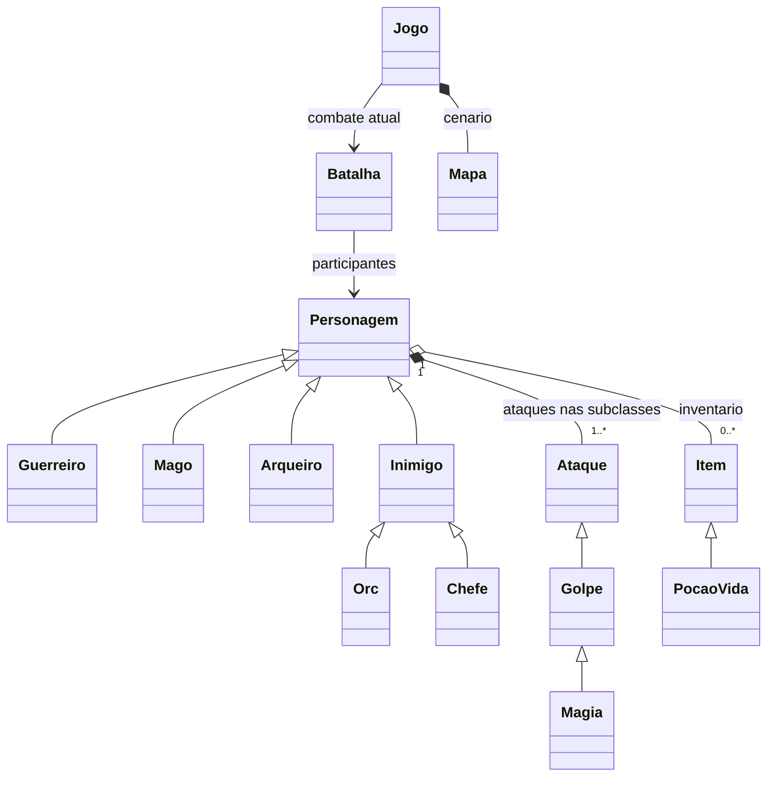

# POO e decisões do projeto

## Responsabilidades

`main` traduz eventos do teclado em chamadas para `Jogo`. `Jogo` coordena o mapa e as transições; cria `Batalha` ao encontrar um inimigo. `Batalha` chama os comportamentos de seus participantes. Personagens guardam ataques e itens; esses objetos executam seus efeitos. `interface` apenas consulta o estado e desenha.

## Relação com as aulas

| Conteúdo | Aplicação |
|---|---|
| Python básico e módulos | Listas de ataques/inventário, mapa em strings, dicionário de teclas, laços e arquivos separados |
| Classes, objetos, self e construtor | Cada jogador, inimigo, ataque, item e batalha é uma instância |
| Encapsulamento | `_vida`, `_vida_maxima`, `_mana`; propriedades sem setter; alterações pelos métodos que preservam limites |
| Associação | Batalha recebe referências aos participantes; Personagem consulta um Mapa recebido |
| Composição | Cada personagem cria sua lista e seus ataques; itens do inventário colaboram com o personagem |
| Herança e super | Guerreiro/Mago/Arqueiro especializam Personagem; Orc/Chefe especializam Inimigo |
| Polimorfismo | Batalha chama `atacar()` sem descobrir a classe; Chefe sobrescreve a seleção do golpe; Mago especializa o descanso |
| Abstração | Ataque e Item usam ABC/abstractmethod e impedem instâncias sem implementação |
| Dunder | `Ataque.__str__()` fornece uma descrição legível dos ataques, incluindo mana em Magia |
| Exceções | ValueError informa ação inválida; o controlador mostra a mensagem; validação acontece antes da alteração de estado |
| Testes | unittest, AAA, assertEqual/assertRaises e Mock com resultados previsíveis |
| Git | Uma issue, branch, commit de implementação e PR por etapa; main atualizada após o merge |

Python não torna `_vida` inacessível: o sublinhado é convenção. A API pública controla o estado; alterar atributos internos diretamente pode violar as regras. `property` sem setter impede atribuição pela propriedade pública.

## SOLID

- **S — Single Responsibility (responsabilidade única):** regras de dano pertencem a Personagem; turnos a Batalha; caminhos a Mapa; desenho a interface. Mudar uma regra não exige misturá-la com eventos gráficos.
- **O — Open/Closed (aberto-fechado):** novas classes e ataques implementam os contratos existentes. Arqueiro e Orc entraram sem editar Batalha. O ponto de montagem e a interface ainda precisam conhecer novas escolhas/símbolos; o princípio não exige zero alterações em todo o programa.
- **L — Liskov Substitution (substituição de Liskov):** todas as subclasses podem participar de Batalha com a mesma chamada de ataque e invariantes de vida. O Chefe muda o comportamento, preservando parâmetros e retorno de texto.
- **I — Interface Segregation (segregação de interfaces):** Item só exige `usar`; Ataque só exige `executar`. Guerreiro não precisa implementar métodos de mana; esse recurso pertence a Mago e Magia.
- **D — Dependency Inversion (inversão de dependências):** Batalha recebe participantes e a função de sorteio, usando seus contratos de comportamento. Ela não importa Pygame, Guerreiro ou Mago. O sorteio real pode ser substituído por Mock. Aqui usamos duck typing; Protocol não é necessário para executar.

## UML simplificado

## Regras estruturais

- `receber_dano` retorna o dano efetivo, limitado à vida restante. A vida nunca fica negativa.
- `usar_item` primeiro aplica o efeito e só depois remove o item. Uma exceção preserva o inventário.
- `Batalha.agir` só executa o contra-ataque após ação válida e com ambos vivos. Erro de precisão é resultado válido, não exceção.
- Depois de vitória, `descansar()` recupera recursos dentro dos limites; no Mago, `super()` conserva a regra de vida e acrescenta mana.
- `Mapa.proximo_passo` faz busca em largura com lista de posições e conjunto de visitados. É uma solução pequena para contornar paredes; a grade tem apenas 24 × 14 casas.
- Interface pode conhecer as classes para escolher artes e mostrar mana. As regras de batalha permanecem independentes dessa escolha.
- O bloqueio do chefe pertence à progressão da campanha em Jogo. Seu ataque de fúria pertence ao próprio Chefe.

O projeto não força iteradores personalizados, geradores ou frameworks só para exibir conteúdos das aulas. A parte gráfica e o empacotamento são infraestrutura; a lógica usa os conceitos de POO estudados.
